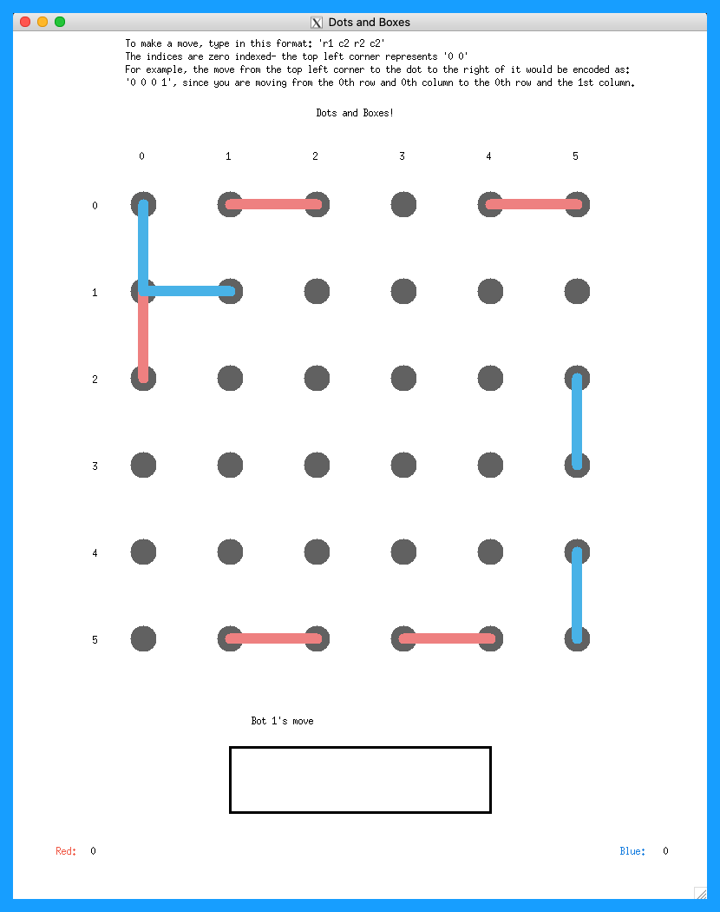

The classic game of Dots and Boxes made in OCaml!

- OCaml Version 4.11.1 

(Higher versions may work)

## Screenshots

### GUI Version:

Beginning of Game:



Mid Game with boxes filled:


Mid Game 2:


End Game Screen (All boxes are filled):


### Terminal Version:
Start Screen:


Stats Screen:


## Necessary Packages 
- OUnit2 
- ANSITerminal 
- OCaml Graphics Library 

## Install Instructions
- Download the latest version of OCaml
- Install the necessary packages
- Clone the game from GitHub
- Open the folder in VSCode (or preferred editor)
- Run the commands (below) to play

## How to Play (2 Methods):

### Method 1 - Play game in GUI:
- To play Simulation (AI vs AI): 
  - At the bottom of draw_board in gui.ml, change the desired difficulty of the bots (Easy, Medium, Hard). Ex:   
  ```
  if mode = "Simulation" then
    loop_simulation default_board "Medium" "Hard" bot1
  ```
  - Change the string input in open_board so it is "Simulation". Ex:
  ```
  draw_board board_dimensions window_dimensions counter_dimensions "Simulation"
  ```

- To play Multiplayer (Player vs Player): 
  - At the bottom of draw_board in gui.ml, change the respective modes to "Mult". Ex:   
  ```
  else player_input () default_board player1 "Mult"
  ```
  - Change the string input in open_board so it is "Mult". Ex:
  ```
  draw_board board_dimensions window_dimensions counter_dimensions "Mult"
  ```

- To play against AI (Player vs AI): 
  - At the bottom of gui.ml change the string input in draw_board so it is the AI difficulty you want (Easy, Medium, Hard). Ex: 
  ```
  else player_input () default_board player1 "Easy"
  ```
  - Change the string input in open_board so it is the desired difficulty. Ex:
  ```
  draw_board board_dimensions window_dimensions counter_dimensions "Easy"
  ```
In the terminal:
- Run `make clean` 
- Run `make build`
- Type `utop` then hit enter
- Once in utop, type `#use "gui.ml"`
- GUI will appear in a window on your desktop

(Press 'q' anytime to quit out of GUI)

### Method 2 - Play game in terminal:
In the terminal:
- Run `make clean` 
- Run `make build`
- Type `rm main.byte` then hit enter
- Type `make play` then hit enter
- Follow the instructions to play the mode you want
